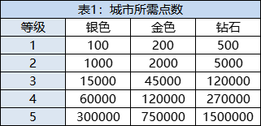

# A activity
    `在Admin网站修改任何数据，一定要确定好 “服务器端口” 选择的对不对！！！`
# STAMPS
    描述
# STAMPS
    描述

### Genie 灯神
    data:
        {"genie_bonus_a": 
            {"available": 0, 
             "task_type": 11, 
             "game_prize": {}, 
             "level": 0, 
             "season": 0, 
             "current": 0, 
             "game_disconnection": {}, 
             "reset_ts": 1659672000, 
             "target_special": 0, 
             "target": 6}, 

         "genie_bonus_b": 
            {"available": 1, 
             "task_type": 10, 
             "game_prize": {}, 
             "level": 0, 
             "season": 0, 
             "current": 0, 
             "game_disconnection": {}, 
             "reset_ts": 1659585600, 
             "target_special": 0, 
             "target": 6}}
# BYD

`Byd free_chest_ts`: 首次免费领取建筑道具的时间戳 
`Byd chest_data`: [`Common`:1, `Rare`:1, `Epic`:1, `Legendary`:1] BYD道具数量 
`Byd items_data`: BYD建筑数据 

        BYD建筑数据:
            [[建筑1],[建筑2],[建筑3],[建筑4],[.....],[建筑9]]共9个建筑
            [建筑等级,建筑总经验,建筑宝箱领取时间]: 一个建筑的数据

`Byd byd_start_ts`:领取引导赠送`depot`道具的时间戳 
`Byd chest_exp`:  
`Byd is_collected`: BYD全建筑集齐收奖状态 `0`未收奖 or `1`已收奖 
`BYD current_season`: BYD赛季  
`BYD gallery [[], []]`:历史赛季建筑完成度，每个`[]`内相当于一个赛季的`Byd items_data`数据 
`BYD_rank_building`: 摩天大楼经验值 
# ATW

`guide`: 新手引导 
`season`: 赛季 
`start_ts`: 领取引导赠送`bag`道具的时间戳 
`season_collected`:  
`store_point`:  
`shop_list`:  

    shop_list: 
            [[800,0],[1000,1],[1000,1]] :此数据为一个商店的3个道具list 
            `800` = 道具当前经验上限 ，`0` = `0`未收奖 or `1`已收奖
`wild_bag_list`:  
`shop_collected_list`: 每个值对应每个商店的收奖状态 `0`未收奖 or `1`已收奖 
`shops_gallery: [[], []]`:历史赛季ATW商店完成度，每个`[]`内相当于一个赛季的`shop_list`数据 
`quality`:  
`ATW Flag`:  
`Round`: 轮次 
`bag_progress`:  
`atw bag list`: [`Common`:1, `Rare`:1, `Deluxe`:1, `Epic`:1, `Premium`:1] ATW道具数量 