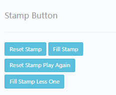
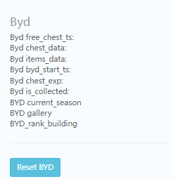

# A Activity
## STAMPS
    描述

### Genie 灯神
    data:
        {"genie_bonus_a": 
            {"available": 0, 
             "task_type": 11, 
             "game_prize": {}, 
             "level": 0, 
             "season": 0, 
             "current": 0, 
             "game_disconnection": {}, 
             "reset_ts": 1659672000, 
             "target_special": 0, 
             "target": 6}, 

         "genie_bonus_b": 
            {"available": 1, 
             "task_type": 10, 
             "game_prize": {}, 
             "level": 0, 
             "season": 0, 
             "current": 0, 
             "game_disconnection": {}, 
             "reset_ts": 1659585600, 
             "target_special": 0, 
             "target": 6}}
## BYD

`Byd free_chest_ts:`:  
`Byd chest_data:`:  
`Byd items_data:`:  
`Byd byd_start_ts:`:  
`Byd chest_exp:`:  
`Byd is_collected:`:  
`BYD current_season`:  
`BYD gallery`:  
`BYD_rank_building`:  
## ATW

`guide`:  
`season`:  
`start_ts`:  
`season_collected`:  
`store_point`:  
`shop_list`:  
`wild_bag_list`:  
`shop_collected_list`:  
`shops_gallery`:  
`quality`:  
`ATW Flag`:  
`Round`:  
`bag_progress`:  
`atw bag list`:  