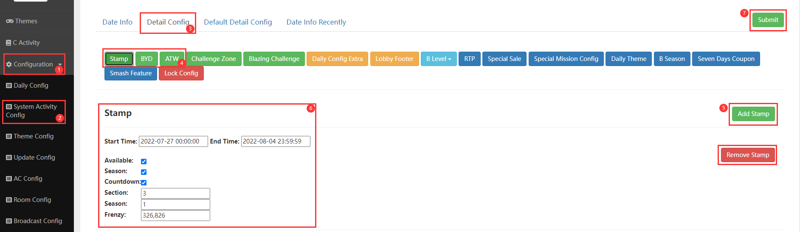
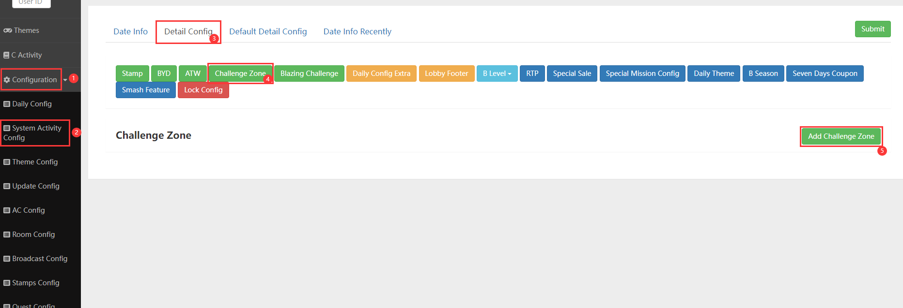
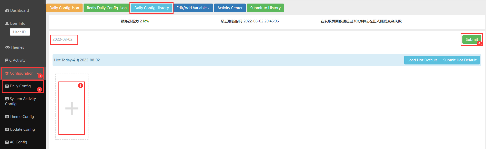

# 活动配置
<!-- [活动配置页](http://192.168.201.203:8000/dashboard/config) -->
    注意：只要在Admin网站作弊，一定要确定好服务器选择对不对！！！
    Admin上的配置时间一般都为东部时间！
## A级活动配置

    1. 左侧列表打开 `Configuration` 页签  
    2. 选择 `System Activate Config`页签  
    3. 选择 `Detail Config`  
    4. `Stamp` `BYD` `ATW` 3个为A级活动配置  
    5. 如果为空，点击右侧绿色`Add ***`按钮添加一个或两个配置（跨赛季用）  
    6. 右侧红色 `Remover` 按钮，可以直接清除当前已有的配置  
    7. 配置完成后，点击右上绿色 `Submit` 按钮进行保存配置  

    Stamp：  
        Start Time: 2022-07-27 00:00:00 开始时间  
        End Time: 2022-08-04 23:59:59 结束时间  
        Available: ☑ 此项需要固定勾选  
        Season: ☑ 赛季需要固定勾选  
        Countdown: 此项是赛季末时，footer图标上显示倒计时，勾选为显示  
        Section: 此项的值 = 第几年 0开始计算  
        Season: 此项的值 = 每年的第几季度，每3个月一季度  
        Frenzy: 此项为本赛季的frenzy邮票可以在，这哪个主题内spin获得（填主题ID）  

    BYD：  
        Start Time: 2022-07-27 00:00:00 开始时间  
        End Time: 2022-08-04 23:59:59 结束时间  
        Available: ☑ 此项需要固定勾选    
        Countdown: 此项是赛季末时，footer图标上显示倒计时，勾选为显示  
        Season: 此项的值 = 第几赛季，每3个月1个赛季  

    ATW：  
        Start Time: 2022-07-27 00:00:00 开始时间  
        End Time: 2022-08-04 23:59:59 结束时间  
        Available: ☑ 此项需要固定勾选    
        Countdown: 此项是赛季末时，footer图标上显示倒计时，勾选为显示  
        Season: 此项的值 = 第几赛季，每3个月1个赛季  

## B级活动配置

    1. 左侧列表打开 `Configuration` 页签  
    2. 选择 `System Activate Config`页签  
    3. 选择 `Detail Config`
    4. `Challenge Zone` 为B级活动配置  
    5. 如果为空，点击右侧绿色`Add ***`按钮添加一个或两个配置（跨赛季用）  
    6. 右侧红色 `Remover` 按钮，可以直接清除当前已有的配置  
    7. 配置完成后，点击右上绿色 `Submit` 按钮进行保存配置 

    Challenge Zone：  
        Start Time: 2022-07-27 00:00:00 开始时间  
        End Time: 2022-08-04 23:59:59 结束时间  
        New: 此项选择哪个B级，哪个B级入口就有new标签显示
        Available: ☑ 此项需要固定勾选  
        Season:	根据对应赛季进行配置
        最后一列的☑： 默认勾选就等于开启，不勾选则对应B级入口显示维护状态，Gof和Makeover只能勾选一个，有互斥  

## C级活动配置

    1. 左侧列表打开 `Configuration` 页签  
    2. 选择 `System Activate Config`页签  
    3. 选择 `Daily Config`