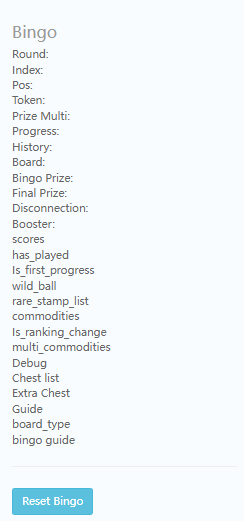

# B Activity
## 配置

## Bingo
<!--    -->
`Round:`: 轮次    
`Index:`: 小关  
`Pos:`: 位置  
`Token:`: token数量  
`Prize Multi:`:   
`Progress:`:   
`History:`:   
`Board:`: 小关数据  
`Bingo Prize:`: 奖励  
`Final Prize:`:   
`Disconnection:`: 断线数据  
`Booster:`: [ 0, 0] ：booster1和2，两个时间戳  
`scores`:   
`has_played`:   
`Is_first_progress`:   
`wild_ball`: wild token也是booster3   
`rare_stamp_list`:   
`commodities`:   
`Is_ranking_change`:   
`multi_commodities`:   
`Debug`:   
`Chest list`: 奖励宝箱list   
`Extra Chest`:   
`Guide`: 引导  
`board_type`:   
`bingo guide`: 引导  
 : reset bingo数据

## Archer
## Cooking
Round
Index
Token
Progress
Has_played
Boosters
Play Flag
Storage
Collected
Dish Prize
Index Prize
Final Prize
Guide
Free_token
Avg Bet
Wild Token
Commodities
Is_ranking_change
Extra Prize
Recycle storage
completed_dish
base_dish_prize
prize_type
is_choose_prize
special_level_cur_score
special_level_end_ts
special_level_limit_prize

## Journey
Round
Pos
token
Super Dice Rolls
Progress
Boosters
Final_Prizes
Disconnection
Has_played
Journey_length
Has_boss
Boss_round
Left_try
Boss_progress
Is_first_progress
avg bet
super_candy
commodities
rare_stamp_list
multi_commodities
chest_list
extra_chest
boss_life_chips
guide
boss index

## Makeover
token
round
index
pos
super_prop
disconnection
map_config
level_progress
select_list
honeycomb_points
honeycomb_final_prize
red_grid_prize
honeycomb_complete_list
tobe_unlock_grid
index_prize
round_prize
prize_ratio
boosters
## Rocket
Round
Index
Position
Token
Progress
Prize Multiplier
Boosters
Super Token
Index Prize
Final Prize
Disconnection
Rocket Avg Bet:
Rocket Has_played
commodities
next_step_num
Limit List
Limit TS
helmet
multi_commodities
send_gift_count
Extra Prize
prize_type
is_choose_prize
guiide
hold helmet

## Blast
Blast Pick:
Blast Round:
Blast Level:
Borad List:
Board Index:
Chest:
Position List:
Win List:
Pick Index:
Index Pirze:
Blast Max Purchase:
Blast Purchase Count:
Blast Last Purchase Time:
Blast Deal Purchase id:
Blast Deal Purchase Price:
Blast Booster:
Blast Super Pick:
Blast Has Played
Progress
Commodities
add_list
Guide
Extra Prize
prize_type
mini_theme
extra_chest
disconnection
jp_status
## Mow
Token
Index
Round
Pos List
Index Prize
Round Prize
Prize Ratio
Super Wand
Has played
Extra Prize
Boosters
Pick Count
Has Puzzle Game
Puzzle History
Puzzle Board
Super Pick
No Puzzle
FFT
First Puzzle Game
Guide
Prize Type
Is Choose Prize
Scene Guide
multi_commodities
Free Wand
detect times
## B Activity Choice
Season 194
Choice blast
Token Stash []
Last B Name bingo
B token buy times 0
B token buy price 49.99
B token last reset ts 1659492306
Guide 6
Dash collected [0, 0, 0]
b guide {"bingo": {"10": 1, "15": 1, "14": 1, "17": 1, "16": 1, "19": 1, "18": 1, "1": 1, "3": 1, "2": 1, "5": 1, "4": 1, "7": 1, "6": 1, "9": 1, "8": 1}, "rocket": 6, "cooking": 8, "mow": {"P2": 1, "P3": 1, "P1": 1, "P6": 1, "P7": 1, "P4": 1, "P5": 1, "P8": 1, "P9": 1}, "makeover": {"p2": 1, "p3": 1, "p1": 1, "p4": 1}, "archer": 6, "tower": 5, "blast": 0, "journey": 3}
Max Store Purchase 2300
B Last Season {"bingo": 180, "archer": 180, "cooking": 180, "mow": 180, "journey": 180, "blast": 194}

## B Ranking
Scores 0
Season 194
Ranking Level 2
Last Season 193
Last Ranking Level 2
Need Collect 0
Migration Flag 1
Disconnection {"ranking_level": 2, "last_season": 193, "name": "b_activity", "coins": 648000000000, "place": 0, "reward_type": 1, "has_prize": 1}

## b_store_manager
season 194
buy_times {"24": 1, "25": 5, "26": 2, "27": 3, "20": 3, "21": 2, "22": 3, "23": 5, "28": 3, "29": 1, "1": 10, "3": 5, "2": 1, "5": 4, "4": 6, "7": 3, "6": 5, "9": 2, "8": 2, "11": 3, "10": 1, "13": 2, "12": 1, "15": 3, "14": 2, "17": 4, "16": 3, "19": 2, "18": 3, "31": 10, "30": 4}
discount_store_data {"11": [1, 1, 180], "25": [5, 5, 135], "17": [1, 1, 175], "16": [1, 1, 200], "23": [1, 1, 108], "28": [1, 1, 180], "4": [6, 6, 45], "7": [1, 1, 90]}
guide 0
[活动配置](Activity.md)