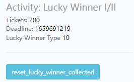

# lucky winner
   [注意]：`修改数据时一定要修改正确后再登录`

  
`[Tickets]`：彩票数量  
`[Deadline]`：活动倒计时  
`[Lucky Winner type]`：对应某个 Lucky Winner 活动的值  
`[reset_lucky_winner_collected]`：清除Lucky Winner活动的中奖状态
### 登录收奖
 1. 配上活动
 2. 完成购买得到`tickets`
 3. 下线
 4. 联系后端发奖
 5. 修改数据
    1. （`Activity: Lucky Winner I/II` 的 `[Deadline]` 修改为当前时间）
    2. 点击 `[set First login today]` 按钮
 6. 下掉活动（等待约30s，活动配置完全刷新）
 7. 登录
### 跨天在线收奖
1. 配上活动
2. 完成购买得到tickets
3. 下线
4. 联系后端发奖
5. 修改数据 （`Activity: Lucky Winner I/II` 的 `[Deadline]` 修改为当前时间）
6. 登录
7. 下掉活动（最多等待约30s，活动配置完全刷新）
8. 点击 Admin 上 `[set today begin]` 按钮  

   服务器发奖后，活动中心会展示Lucky Winner活动的`中奖状态`！  
   点击 `Activity: Lucky Winner I/II` 的`[reset_lucky_winner_collected]` 可以清除活动中心的中奖状态显示

