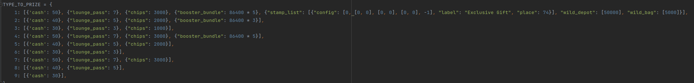

[adv]:images/adv_debug.png
# 个人数据
    `在Admin网站修改任何数据，一定要确定好 “服务器端口” 选择的对不对！！！`
`Last Login Date`: 账号最后一次login时间戳 
`First Login`: 账号创建时间 
`Last Login`: 账号上次一次login时间 
`last Logout`: 账号上次下线时间 
`Level`: 等级 
`VIP`: VIP等级 
`Credits`: 拥有的`coins`数量 
`Lounge Points`: 高级房点数 
`Lounge Ts`:高级房倒计时 
`Free Lounge Points`: 待确认 
`ranking_level`: 排行榜房间等级 
`is_admin`: 和`user status`功能一致，但是好像不生效了 
`b_season`: 当前B级赛季 
`level_burst_bug_flag`: 待确认 
`lounge_reward_points`: 待确认 
`ooc_coin_count`: 总付费次数 
`last_ranking_level`: 上次排行榜房间 
`pick_bonus_disconnection`: pick_bonus 断线数据 
`new_b_used`: 待确认 
`old_b_used`: 待确认 
`next_today_begin`: 账号上线时间戳，改成过去时间，再上线可以重置账号跨天状态 
`next_first_login`: 账号上线时间戳，改成过去时间，再上线可以重置账号跨天状态 
`stamp_round`: 待确认 
`bc_avg_bet_ls`: 待确认 
`behaviour_data_bug_fix`: 待确认 
`mistery_bank_breaker_flag`: 待确认 
`over_mp_chest_user_start_ts`: 待确认 
`last_birthday`: 改成`[0,0,0]`可触发生日周年弹窗 
`mp last season purchase`: 上赛季的MP解锁状态 
`mp current season purchase`: 当前赛季的MP解锁状态 
`user status`: 为`3`时是可以手动调整r level的等级；为`0`时是模仿真实用户登录情况 
`first_quest_end_ts`: [[Quest| 新手期倒计时]] 
`user_icon_id`: 正在使用的头像ID 
`nick_name`: 游戏内编辑的name 
`inbox bonus ts`: 待确认 
`store_free_bonus_ts`: store bonus的收奖倒计时，改成过去式时间戳，可重置 
`lounge_reward_coef`: 待确认 
`starter_kit_normal`: 待确认 
`icon_list` 已拥有的头像ID list 
`vip_points`: VIP点数 
`flag6`: 国内ip进不去游戏时，将此数据改成`10` 
`store_bonus_prompt_ts`: 待确认 
`client_resources_flag`: 清除游戏内某个客户端资源，数据格式为：[[2, '资源名称1'], [2, '资源名称2']] 
`first_quest_finish_prize`: 新手期奖励 
`weekend_tournament_ranking_level`: 周末锦标赛，排行榜房间 
`weekend_tournament_last_ranking_level`: 周末锦标赛，上次排行榜房间 
`tc_bonus_flag` {} 
`lobby_list`: 拥有的大厅UI 
`current_lobby_ui_id`: 当前使用的大厅UI 
`tc_challenge_end_ts` 0 
`last_b_season`: 最后一次的B级赛季 
`max_purchase`: 最高付费金额 
`selected_favourite_theme`: 喜欢主题的list 
`supplement_chips_status`: 改成`0`重置第二货币用尽促销 
`first_get_b_token`: B级免费token的领取状态 
`first_play_b_system`: B级九选一的选中游玩状态 
`lounge_guide`: 高级房引导 
`lounge_free_collected`: 高级房引导中的free pass卡领取状态 
`lounge_transform_info`: 待确认 
`mp_send_free_booster_flag`: 赠送免费的mission star booster弹窗 
`novice_end_first_login`: {quest.md} 
`novice_reward`: [[Quest#.E6.96.B0.E6.89.8B.E5.9F.BA.E9.87.91|新手基金]] 
`novice_end_time`: [Quest|新手基金] 
`store_stamp_count` lucky chames的数量 
`lounge_store_week_ts`: lounge兑换商店道具刷新倒计时 
`daily_login_count`: 当天的第几次login，一般用于看login强弹 
`mp_buy_bundle_season`: 待确认 
`stamp_easter_egg_ts`: 待确认 
`no_adv_return_end`: 7天内免费看广告的结束时间戳 
`total_purchase `: 用户的全部付费额 
`another_first_quest_flag`: 新手ABtes，取消了 
`new_ad_theme_fg_limit`: 主题内FG后，广告翻倍播报弹出次数上限 
`new_ad_theme_fg_ts`: 主题内FG后，广告翻倍播报CD时间 
`welcome_back_free_soc`:  
`welcome_end_ts`:  
`p_user_ad_type`: 广告用户type 
`welcome_type`: 回归用户的type，对应回归的分类逻辑 
`welcome_first_day_end_ts`:  
`welcome_no_popup`: 回归活动的禁止活动强弹的状态 
`welcome_no_popup_end_ts`: 回归用户的禁止活动强弹结束时间 
`welcome_bundle_flag`: 回归bundle的触发状态 
`login_load_ts`: 下载逻辑，锁定用户状态的时间戳 
`login_load_type`: 下载逻辑，不同用户的type 
`welcome_upgrade`:  
`new_ad_byd_ts`: BYD看广告，广告间隔的CD时间 
`new_ad_byd_count`: BYD看广告次数，上限`10`次 
`new_ad_byd_reset`: BYD看广告的每日重置时间戳 
`new_ad_byd_reset`:  
`send_coupon_reset_ts` 0 
`welcome_upgrade_booster` 0 
`welcome_upgrade_coins_ends` 0 
`web_client_prize_collected` 0 
`welcome` p4 end ts 0 
`knight_race_status` {} 
`knight_race_type` 
`vip_point_clear_flag` 2022 
`bind_phone` 93415154612 
`client_online_update_flag` 1 
`christmas_gift` [] 
`sign_data` {"store_guide": 1, "smash_egg": 4} 
`_r_level_test` -1 
`cg_spin_res_num` cash go的spin作弊 
`frenzy_mission_final_prize` {} 
`spin_up_close_reward_flag` 0 
`language_id` 默认选择的语言：英语：0，繁中：1，日语：9，德语：4 
`unlock_tag` 3 
`cg_limie_sale` {"42": {"limit_count": 1, "active_ts": 1686119285, "limit_count_all": 1, "active_limit": 1, "buy_date": "2023-06-07", "item_id": "42", "limit_end_ts": 1686133685}} 
`cg_inbox_fb_gift_ts` 1686196800 
`last_purchase_id` 3231 
`mp_send_eggs_flag` 1 
`cg_steal_uid` cash go攻击/偷钱目标的id 
`mp_buy_bundle_season` MP最后一次购买bundle的赛季 
`cg_total_purchase` cash go里的总付费 
`cg_recent_purchase`  
`novice_rlevel` 新手基金 r level等级 
`new_ad_theme_gm_limit` 0 
`new_ad_theme_gm_ts` 0 
`fb_bind_pop_ts` FB绑定弹窗弹出的时间 
`fb_bind_pop_count` FB绑定弹窗弹出次数 
## frenzy_vault
`a_data`: [`BYD`, `STAMP`, `ATW`] 3个A级道具的puzzle碎片数量 
`b_prop_list`: 对应B级的token数量

        [archer,bingo,blast,cooking,gof,journey,rocket,sail,tower,mow]
        [330, 355, 1404, 5062, 0, 601, 1109, 400, 51, 303, 28, 321]
`c_data`: [] 
`a_type`: [] 
`b_store_data` {"`b_store`": `lucky_loot数量`, "is_get_lucky_loot": 1} 
<!-- `c_type`: []  -->
`chips`: 第二货币数量 
`frenzy_spin`: 邮票里frenzy spin的次数 

## Mission
`Reset Ts`: mission倒计时间戳，改成过去时间可以重置daily mission的完成状态 
`Wheel Collected`: Mission Points领奖状态 
`Mission Points`: Mission Points点数 
`Index`: 第几个mission任务 
`Type`: 当前mission任务的Type 
`Target`: 当前mission任务的目标值 
`Current`: 当前mission任务的进度值 
`Target Special`: 待确认 
`Target M7 Special`: 待确认 
`Target M7 Retry`: 待确认 
`Wager`: 待确认 
`Index_prize`: 当前mission任务的奖励数据 
`Avg Bet`: 待确认 
`Disconnection`: 断线数据 
`Wheel Extra Chance`: 待确认 
`Wheel Unused Chance`: 待确认 
`Guide`: 引导 
`Glory Mission Reset Ts`: 待确认 
`Glory Mission Type`: 当前HONOR Mission任务的Type 
`Glory Mission Target`: 当前HONOR Mission任务的目标值 
`Glory Mission Current`: 当前HONOR Mission任务的进度值 
`Glory Mission Wager`: 待确认 
`Glory Mission Prize`: 当前HONOR Mission任务的奖励数据 
`box_collected`: 待确认 
`Glory Mission Finish Flag`: 待确认 
`Glory Mission Unlock Flag`: 待确认 

## Mission Pass

    需要重置mission pass时，可以直接将Season数据改为上个赛季进游戏

`Exp`: 经验值 
`Level`: 等级 
`Season`: 赛季 
`Mission Pass Type`: 0未解锁，对应r_level+1值解锁解锁 
`Available Free Reward []`: free level 数据 
`Available High Reward []`: pass level 数据

    Reward level 数据初始 [0] 有个0级的, 升到5级显示[0,1,2,3,4,5]
    下面是python的迭代 0 ~ 100
    a = [i for i in range(101)] #迭代0 ~ 100
`Free Pass Prize {}`: free奖励数据 
`Mission Pass Prize {}`: pass奖励数据 

    {"0": [0],"1": [0] ,"2": [0]~ "100": [0]}: Prize 数据是这种类型，
    "0" : 代表着0~100级，[0] : 奖励领取状态 [0] 未领取, [1] 已领取
`Store Info {}` 
`Free Player Flag` 
`Time Limited Prize []`: 限时奖励 

    限时奖励:
        例: [1, 1, 1659628802]
        由10个 [0,0,0] list组成，每个代表每10级后面的那个限时奖励，list都值为0时，该限时奖励未触发，
        第一位和第二位为1时，该限时奖励已触发，
        第一位和第二位为2时，该限时奖励已完成，
        第一位和第二位为-1时，该限时奖励已过期，
        第三位为时间戳，触发限时奖励倒计时开始
`Chest Level`: mission pass宝箱等级 
`Chest Prize`: mission pass宝箱奖励 
`Boosters`: mission star booster的倒计时 
`Booster Multi`: mission star booster的倍率 
`Chest exp`: mission pass宝箱经验 

## Mission Pass Plus

`season`: 赛季 
`level`: 等级 
`exp`: 经验值 
`mission_pass_plus_type`: 0未解锁，对应r_level+1值解锁 
`mission_pass_plus_prize_data`: 与普通Mission Pass数据一样 
`available_reward_data`: 与普通Mission Pass数据一样 
`chest_exp`: super pass 宝箱经验 
`chest_level`: super pass 宝箱等级 
`chest_prize_data`: super pass 宝箱奖励 
`last_mp_plus_type`: 上赛季 super pass 激活数据 

## MP Guide
`Guide`: Mission pass 的新手引导步数，重置改0 
`Qualification`: 解锁MP 1$ 资格 
## mission pass debug

    在后台修改对应字段配置，可以切换不同状态的解锁弹窗，共有5种状态！
 

## Smash Egg
`Gold Hammer Status`: 每天领取金锤子的数量 
`Gold Hammer Extra`: 购买金锤子的数量 
`Gold Hammer Disconnection`: 断线数据 
`Gold Hammer Flag`: `1` = 已经砸过蛋了，`0` = 未砸蛋 
`Silver Hammer Status`: 每天领取银锤子的数量 
`Silver Hammer Extra`: 购买银锤子的数量 
`Silver Hammer Disconnection`: 断线数据 
`Silver Hammer Flag`: `1` = 已经砸过蛋了，`0` = 未砸蛋 
<!-- `Hammer Reset Ts`: 待确认 
`Old Player Flag`: 待确认 
`Gold Shell Pos LIst`: 待确认 
`Gold Shell Win List`: 待确认 
`Gold Shell Round`: 待确认 
`Gold Shell Pick`: 待确认 
`Gold Shell Status`: 待确认 
`Silver Shell Pos LIst`: 待确认 
`Silver Shell Win List`: 待确认 
`Silver Shell Round`: 待确认 
`Silver Shell Pick`: 待确认 
`Silver Shell Status`: 待确认 
`Special Chips Purchased`: 待确认 
`Reset Feature Ts`: 待确认  -->
## Exclusive Gift
`Prize Type` 1-9个类型，最终会给不同的奖励 
`Next Ts` 冷却时间 
`Current Count` 领取奖励次数 
`Debug Ratio` 
`debug1-3` 用来触发不同的级别的防流失（就是奖励不一样）1级别最高奖励最多 
 

## Blazing Challenge
`EXP`: 经验值 
`Level`: 等级 
`Season`: 赛季 
`Season End`: 赛季结束倒计时 
`Missions`: 待确认 
`Mission End`: 待确认 
`Prizes`: 奖励 
`Bonus Game Disconnection`: 小游戏断线数据 
`Ranking Prize Disconnection`: 排行榜断线数据 
`Avg Bet`: 待确认 
`Mini Theme Next Time`: 待确认 
`EXP Activity 31002`: 待确认 
`END Time Activity 31002`: 待确认 
`Boosters`: 火力值booster 
`Commodities`: 待确认 
`History Rank`: 历史上榜记录 

## Mansion Quest
`name`: 待确认 
`stars`: 星星数量 
`room`: 房间数据 
`room mission`: 流程数据 
`finish current phase`: 待确认 
`mission`: 待确认 
`disconnection room mission`: 待确认 
`home_phase`: 待确认 
`boosters_data`: booster倒计时 
`skip_card`: skip卡数量 
`mission_stage_data`: 待确认 
`flash tag`: 待确认 
`stage prize`: 待确认 
`房间奖励数据`: 待确认 
`当前房间奖励`: 待确认 
`房间奖励断线数据`: 待确认 
`新主题任务`: 待确认 
`新主题idx`: 待确认 

## Mansion Quest Ranking
`mq tid`: 当前主题id 
`round index`: 关卡 
`round points`: 星星数量 
`round target`: 待确认 
`season`: 赛季 
`mansion lv`: 待确认 
`mission`: 待确认 
`round prize`: 待确认 
`rank prize`: 待确认 

## level_up_party
`index`: 第几个进度 
`tasks`: 待确认 
`reset_ts`: 倒计时 
`has_game`: 待确认 
`bet`: 以什么bet触发的本次level_up_party 
`first_flag`: 待确认 
`today_ts`: 今天是否触发过 
`common_game`: 待确认 

## Login Bonus
`week count`: 周签到次数，小于6 
`week type`: 待确认 
`week base coins`: 待确认 
`month count`: 月签到次数，小于30 
`month type`: 待确认 
`month base coins`: 待确认 
`last login`: 待确认 
`has checked in`: 每日签到记录，`1`已签到 `0` 未签到 
`month status`: 待确认 
`ab flag`: 待确认 

## Weekend Tournament
`store_booster_ts`: 周末锦标赛赠送的商店加成倒计时 
`store_booster_multi`: 商店加成的值 
`daily_bonus_booster_ts`: free bonus 加成倒计时 
`daily_bonus_booster_multi`: free bonus 加成的值 
`medal_booster`: 待确认 
`is_collected`: 待确认 
`season`: 赛季 
`race`: 待确认 
`points`: 周末锦标赛点数 
`end_ts`: 周末锦标赛结束倒计时 
`disconnection`: 断线数据 
`ranking_level`: 周末锦标赛排行榜等级 
`last_ranking_level`: 上次周末锦标赛排行榜等级 
`wt_season`: 待确认 
`last_send_inbox_ts`: 待确认 

## Coupon New
`Store Coupon Id`: 手动清除list内coupon时，此数据改`-1` 
`Store Coupon List`: inbox内的`Store coupon` 
`Piggy Coupon Id`: 手动清除list内coupon时，此数据改`-1` 
`Piggy Coupon list`: inbox内的`Money bank coupon` 
`coupon_7days_no_purchase_last_get_ts`: 待确认 
`Emerald Coupon Id`: 手动清除list内coupon时，此数据改`-1` 
`Emerald Coupon List`: inbox内的`Emerald coupon` 
`Chips Bank Coupon Id`: 手动清除list内coupon时，此数据改`-1` 
`Chips Bank Coupon List`: inbox内的`Emerald bank coupon` 

## Discount coupon
`Store Discount Coupon Id`: 手动清除list内coupon时，此数据改`-1` 
`Store Discount Coupon List`: inbox内的`降价coupon`的list 

## inbox sp product
`last_sp_store_end_ts`: inbox内Money bank促销，倒计时间戳 
`sp_piggy_product`: inbox内商店促销: `0`没有，`1`有 
`sp_store_product`: inbox内Money bank促销: `0`没有，`1`有 
`last_sp_piggy_end_ts`: inbox商店促销，倒计时间戳 

## Lobby Bonus
`Megaball Progress`: Megaball 的进度累计值，到3可玩 
`SoC Progress`: SoC 的进度累计值，到5可玩 
`Multiplier`: 待确认 
`Golden Multiplier`: 待确认 
`Turbo ts`: 红色刮刮卡倒计时戳（毫秒） 
`Instant ts`: 蓝色刮刮卡倒计时戳（毫秒） 
`Soc Count`: 待确认 
`Turbo Speedy ts`: 待确认 
`Last Multipler ts`: 待确认 
`Slot Blast ts`: 待确认 

## Purchase: Piggy Bank (New)
`Piggy Bank Balance`: 当前bank数量 
`Piggy Price LV`: 价格等级 
`Piggy Config LV`: 配置等级 
`Piggy Bank Down LV`: 降档（0=不降，1=降一档，2=降两档）最大2 
`Piggy Bank Up LV`: 升档（0=不降，1=降一档，2=降两档）最大2 
`Piggy Bank Max Days`: 未登录天数（7天降价） 
`Piggy First Purchase`: 1 
`Piggy Bank AB Test`: 0 
`Piggy Bank Data Migration`: 

## Money Bag
`Money Bag Current Coins`: 当前money bank bag积累的钱 
`Money Bag Top Coins`: money bank bag积累上限 

## Emerald Bank
`Emerald Bank`: 当前bank数量 
`Config Level`: 配置等级 
`Price Level`: 价格等级 
`Level up`: 升档（0=不降，1=降一档，2=降两档）最大2 
`Level Down`: 降档（0=不降，1=降一档，2=降两档）最大2 
`Max Days`: 未登录天数（7天降价） 

## Welcome Home
`daily_prize`:  
`daily_prize_end_ts`: 每日奖励倒计时 
`end_ts`: 回归任务倒计时 
`fresh_ts_ls`: 5日任务解锁数据 

    [[1661140799, 1], [1661140799, 1], [1661140799, 1], [1661399999, 0], [1661486399, 0]]
    [[第一天任务开启的时间戳, 1], [第二天, 1], [第三天, 1], [第四天, 0], [第五天, 0]]
    把时间戳改成过去时

`mission_list`: 任务数据 

    一个任务的dict :
        {"collected": 0,         # 任务奖励领取状态
        "progress": [0, 30],    # 进度和目标值
        "delta_points": 10,     # 任务的回归点数
        "mission_type": 22,     # 任务type值
        "prize_config": {"b_token": [3, 3, 3, 3, 3, 3, 3, 3, [360, 0, 0], 3, 3, 3]}}, # 任务奖励
    每天6个任务，[{任务1 dict},{任务2 dict},{任务3 dict},{任务4 dict},{任务5 dict}，{任务6 dict}]
    共5天，[[第1天],[第2天],[第3天],[第4天],[第5天]]
      
`points`: 回归点数 
`prize_list`: 回归点数奖励 
`guide`: 引导步数 
`daily_prize_count`: 每日奖励宝箱领取状态 

## Persona 广告用户
### Advertisement
`total_purchase` 3121 
`max_purchase` 150 
`watch_adv_count` 广告转盘，最大10次 
`all_count` 除广告转盘10，最大看广告次数240次 
`all_count_ts` 最大看广告次数重置时间戳 
`user_source` 广告用户type 

这个按钮点击之后直接强制改成广告用户，只能测试服使用 
- LL 广告用户为真正0付费玩家广告用户 
- HH-OO 用户有固定逻辑才会开启广告 
`p_user_ad_type`: （HH用户 = 1，LL用户 = 2 ，OO用户 = 3）0=非广告用户 
`purchase_type: 2`: （HH用户 = 1，LL用户 = 2 ，OO用户 = 3）0=非广告用户 
`new_ad_3h_counter 12`:  
`new_ad_soc_premium_ts 0`: soc广告倒计时 
`new_ad_pachinko_premium_ts 0`: 博青哥广告倒计时 
`new_ad_atw_ts 0`: atw广告倒计时 
`new_ad_b_token_ts 0`: B级token 广告倒计时 
`new_ad_wheel_multi_fq 1`: 影响的新手做完任务之后奖励金币的数量  
`new_ad_hm_multi_count 3`: 影响的是看广告的奖励 

## Spin Up Boost
`progress`super spinup的累计次数，上限7 

## four_leaf_clover (LC)
`reset_ts` 重置倒计时 
`clover_list` [1, 1, 1]当前LC数量，上限4个值对应4个LC，0=绿色，1=金色 
`last_clover` 最后一次累计的LC数量 
`reward_list` []，转盘扇叶，数值 
`last_reward` []，最后一次的转盘扇叶，数值 
`r_level` 1 
`one_dallor` LC计算的对应1$金币值 
`extra_clover` [] 
`disconnect` {} 
`r_level_gold` 1 

## Cash Club User
`cash_club_id` 工会ID 
`join_req_limit` 2 
`join_req_reset_ts` 加入公会冷却时间倒计时时间戳（毫秒） 
`received_extra_coins` {} 
`no_chat_limit_ts` 0 
`create_club_limit_ts` 创建公会限制时间戳（毫秒） 
`stamp_req_ts` 公会索要邮票倒计时时间戳（毫秒：改成1可以刷新倒计时） 
`club_chest_point` 公会宝箱进度点数 
`club_chest_target_weekly` 公会宝箱档位节点 
`club_chest_prize` 公会宝箱奖励数据 
`fresh_club_chest_target_ts` 公会宝箱结算时间戳（毫秒：改成1可以直接刷新公会宝箱（模拟周三的刷新环境）） 
`all_club_chest_prize` 公会宝箱奖励数据 
`join_ts` 加入公会的倒计时 
`nick_name` PLAYER9324 
`head_img` 
`avg_bet` 170000000000 
`guide` 公会引导 
`jp_likes` 0 
`stamp_req_count` 
`super_member_type` 
`super_club_chest_prize` 
`free_club_point_ts` 
`club_active_point` 公会宝箱收集进度 
`last_club_active_point` 上次公会宝箱收集的进度 
`last_chest_info` 公会宝箱领取记录 
`cash_club_point_booster_ts` 0 
`club chest history` [] 
`fix_coins_flag_35008` 1 
`active_list` [[72, 1702529999]] 
`club chest point history` 
## Cash Go
### SPIN 作弊标记
    
    # remote prize, id
    # θ正常，无送奖状态
    # 1 - 保护1 
    # 5 - 抑制0.5
    # 6 - 抑制0.25
    # 20 - miss
    # 21 - goblin 偷袭
    # 22 - bomb 攻击
    # 23 - potion 能量
    # 24 - shield盾
    # 25 - purse*3 大钱袋
    # 26 - coin*3小钱袋
    # 27 - purse* 2
    # 28 - purse*1
    # 29 - coin*2
    # 30 - coin*1
    # 31 - purse*1 + coin*1
    # 32 - purse*2 + coin*1
    # 33 - purse*1 + coin*2
    # 34 - disco*1
    # 35 - disco*2
    # 36 - disco*3
### 主界面
`_kingdom_coins`: Cash Go的金币 
`_shield_num`: 盾牌数量 
`_crown_num`: 皇冠数量 
`_energy_points`: 基础能量(50封顶，会随着时间流逝恢复) 
`_last_energy_update_ts`: .上次更新能量的时间 
`_extra_energy_points`: 额外能量(基础能量封顶后获得的能量，无法通过时间流逝恢复 
`_activity_symbol_num`: 活动的symbol编号(目前没用) 
`_activity_reset_ts`: 活动重制时间(目前没用) 
`_pet_protect_ts`: 宠物保护的结束时间 
`_active_pet`: 激活的宠物 
`message_list_data`:  
`_kingdom_index`: 小岛等级 
`_kingdom_status_data`: 当前小岛状态 
`_season`: 赛季 
`_kingdom_index_other`: 额外村庄进度(所有小岛完成后开始累计这个进度,每完成一个 
`_new_user_guide_part_data` cash go的引导：{"p2": 10, "p3": 5, "p1": 4, "prize": 1, "p4": 2} 
`_auto_flag` 1 
`_new_user_spin_count` 新手spin次数，大于50进入可被攻击偷钱的随机列表 
`_last_damage_ts` 1691120117 
`_cg_ab` 5.14 
`_new_user_flags` 11 
`_total_purchase_chips` 第二货币总付费，改成0后会有商店100%more加成 
`_total_purchase_dollar` cash go总付费，改成0后触发ooc可以触发破冰促销  

### cash_kingdom_pet
`_good_food_count` 拥有肉的数量 
`_exp_food_count` 拥有经验 
`_free_pet_food_ts`: 免费宠物食物倒计时 
`_pet_info_data` 宠物数据 
    
    {
    "protect": { <-- 宠物解锁后会有该数据 -->
        "pet_exp": 73540,                   宠物经验值 
        "pet_level": 55,                    宠物等级
        "pet_id": 3,                        宠物id
        "pet_name": "protect",              宠物名称
        "pet_active_end_ts": 1676412208},   宠物生效时间戳倒计时
    "steal": {
        "pet_exp": 11080, 
        "pet_level": 7, 
        "pet_id": 1, 
        "pet_name": "steal", 
        "pet_active_end_ts": 1677219660}
    }
### cash_kingdom_ball_machine
`normal_limit_ts`: 普通转盘下次刷新时间戳 
`normal_progress` {"normal_ball": [5, 8, 10, 15, 20, 30, 50], "jp_ball": [1000]} 
`normal_result` {} 
`premium_limit_ts`: 普通转盘下次刷新时间戳 
`premium_progress` {} 
`premium_result` {} 
`premium_need_chips` 1999 

### cash_kingdom_login_bonus
`_base_credits_month` 80000000 
`_base_credits_week` 80000000 
`_check_in` 1 
`_last_ts` 1662611105.717114 
`_month_count` 0 
`_month_status` [0, 0, 0, 0] 
`_type_month` 0 
`_type_week` 0 
`_weekly_count` 0 
### cash go inviter
`invite_index` 奖励的index，每个等级消耗的邀请数不一样 
`invite_progress` 总邀请数，登录后消耗领奖 
`invite_fb_progress` 0 
`invite_fb_num` 0 
`fb_flag` 0 
`normal_invite_ls_info_data` [] 
`fb_invite_ls_info_data` [] 
`invited_from` 
### Cash Go First Promotion
`_limit_ts` 破冰促销倒计时 
`_store_item` 破冰促销数据 
        
        {"soc_speedy_benefit": 43200, "lounge_points_benefit": 300, "vip_point": 36, "price": 1.99, "limit_ts": 1700556320, "cg_coins_num": 10000000, "credits": 75937500, "chip_num": 200, "item_id": 3789, "cg_energy_num": 200, "origin_price": 79.99}

`_daily_count` 破冰促销当日触发3次后不再触发 

## Purchase: Booster
`Level Burst`: LEVEL BONUS BURST 的倒计时, 主要作用是升级时候多给2.5倍的金币奖励, 每10级是25倍 
`Cashback`: cash back的倒计时, 没赢金币的时候按bet的一定比例存下来, 第二天的时候发给玩家 
`Double XP`: LEVEL UP XP*2 双倍经验的booster的倒计时 
`Cashback Balance`: 是cash back当前存下来的金币数量 
`Cashback Date`: 上次cash back发奖日期 
`Bundle Count`:  
`Cashback Ratio List`: cash back的按bet存下来的比率的列表 
`Spin Reward coins`: spin_reward存下来的金币数量 
`Spin Reward Date`: spin_reward上次的发奖日期 
`Spin Reward TS`: spin_reward的结束时间 
`Spin Reward Lounge TS`: 上次spin_reward和lounge_ts同步的时间, 主要逻辑是在获得lounge_ts的时候同时给一些spin_reward的时间 
`Triple XP`: LEVEL UP XP 3X booster 倒计时 
`Storage Double XP`: 开启3X booster时，2X booster时间暂停，暂存在此（秒） 
`Storgae Triple XP`: 暂存 3X booster 的持续时间 
## Limited Offer 商店侧边栏促销
`Season Pack Available Count` 1  
`Season Pack End Ts` 1680148799  
`Week Pack Available` Count List 
`Week Pack End Ts` 
`Coin Pack Count` 1 
`Coin Pack End Ts` 1680148800 
`Chip Pack Count` 1 
`Chip Pack End Ts` 1680148800 
`Bundle Pack Count` 2 
`Bundle Pack End Ts` 1680321600 

## Bonus Voucher
`card level`礼品卡的等级一共1,2,3,4,5,6这些状态, 其中6是开启活动21038时候会触发的特殊状态 
`card dollar` 礼品卡的价值, 根据礼品卡的等级有所不同 
`reset ts` 是每天重制bonus_voucher的时间戳 
`inbox limit` 当天占用了领取次数多少次 
`card num` 这次会发的礼品卡的数量,发送后`card_level`, `card_dollar`, `card_num`都会清0 
`delta_limit` 收奖次数,也是花费第二货币后 获得的收奖次数 
`open_reset_ts` 关闭bonus_voucher的时间戳 

