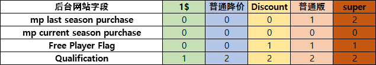

# 系统
## 个人数据

`Last Login Date`: 账号最后一次login时间戳 
`First Login`: 账号创建时间 
`Last Login`: 账号最后一次login时间 
`last Logout`：账号最后一次下线时间 
`Lounge Points`: 高级房点数 
`Lounge Ts`:高级房倒计时 
`Free Lounge Points`: 
`ranking_level` 4 
`b_season` 164 
`level_burst_bug_flag` 
`lounge_reward_points` 0 
`ooc_coin_count` 84 
`last_ranking_level` 4 
`pick_bonus_disconnection` [] 
`mp last season purchase` [mission pass debug](#mission-pass-debug)  
`mp current season purchase` 3 
`user status` 3 
`first_quest_end_ts`：[新手基金](quest.md) 
`user_icon_id`：正在使用的头像ID 
`nick_name` XXL 10666 
`inbox bonus ts` 1659756669 
`store_free_bonus_ts` 1649972625 
`lounge_reward_coef` 165 
`starter_kit_normal` 
`icon_list` 已拥有的头像ID list 
`vip_points` 3372907 
`flag6`：国内ip进不去游戏时，将此数据改成`10` 
`store_bonus_prompt_ts` 1659856557 
`client_resources_flag` [] 
`first_quest_finish_prize` {} 
`weekend_tournament_ranking_level` 1 
`weekend_tournament_last_ranking_level` 1 
`tc_bonus_flag` {} 
`lobby_list` [0, 8] 
`current_lobby_ui_id` 0 
`tc_challenge_end_ts` 0 
`last_b_season` 194 
`max_purchase` 200 
`selected_favourite_theme` [233, 239, 276, 181, 248, 122, 191] 
`first_get_b_token` {"bingo": 0, "rocket": 0, "cooking": 0, "mow": 0, "makeover": 0, "archer": 1, "tower": 0, "blast": 0, "journey": 0} 
`first_play_b_system` {"bingo": 0, "gof": 0, "rocket": 0, "cooking": 0, "mow": 0, "makeover": 0, "journey": 0, "archer": 1, "tower": 0, "blast": 0}
`lounge_guide` {"p2": 1, "p3": 1, "p1": 1, "p6": 1, "p7": 1, "p4": 1, "p8": 1, "free_pass": 1} 
`lounge_free_collected` 1 
`lounge_transform_info` {} 
`mp_send_free_booster_flag` 0 
`novice_end_first_login` [新手基金](quest.md) 
`novice_reward` [新手基金](quest.md) 
`novice_end_time` [新手基金](quest.md) 
`store_stamp_count` lucky chames的数量 
`lounge_store_week_ts` 1660276800 
`mp_buy_bundle_season` 46 
`stamp_easter_egg_ts` 0 

## frenzy_vault
a_data [6394, 335, 80] 
[`archer`,`bingo`,`blast`,`cooking`,`gof`,`journey`,`rocket`,`sail`,`tower`,`mow`]  
[`349`, `355`, `1404`, `5062`, `0`, `601`, `1109`, `400`, `51`, `303`, `28`, `321`] 
`b_store_data` {"`b_store`": 65385, "is_get_lucky_loot": 1} 
chips 45091 
frenzy_spin 974

## Mission Pass

    需要重置mission pass时，可以直接将Season数据改为上个赛季进游戏即可 

`Exp 0`：经验值 
`Level 0`：等级 
`Season 0`：赛季 
`Mission Pass Type 0`：0未解锁，对应r_level+1值解锁解锁 
`Available Free Reward []`：free level 数据 
`Available High Reward []`：pass level 数据

    level 数据初始 [0] 有个0级的, 升到5级显示[0,1,2,3,4,5]
    下面是python的迭代 0 ~ 100
    a = [i for i in range(101)] #迭代0 ~ 100
`Free Pass Prize {}`：free奖励数据 
`Mission Pass Prize {}`：pass奖励数据 

    {"0": [0],"1": [0] ,"2": [0]~ "100": [0]} ：Prize 数据是这种类型，
    "0" : 代表着0~100级，[0] : 奖励领取状态 [0] 未领取, [1] 已领取
`Store Info {}` 
`Free Player Flag 0` 
`Time Limited Prize []`：限时奖励 

    限时奖励:
        由10个 [0,0,0] list组成，第一位为1时，代表该限时奖励已解锁，
        第二位为1时，代表该限时奖励已领取，第三位为时间戳，该限时奖励的倒计时
        例：[1, 1, 1659628802]
`Chest Level 0`：mission pass宝箱等级 
`Chest Prize {}`：mission pass宝箱奖励 
`Boosters [0, 0]`：mission star booster的倒计时 
`Booster Multi [2, 2.5]`：mission star booster的倍率 
`Chest exp 0`：mission pass宝箱经验 

## Mission Pass Plus

`season 0`：赛季 
`level 0`：等级 
`exp 0`：经验值 
`mission_pass_plus_type 0`：0未解锁，对应r_level+1值解锁 
`mission_pass_plus_prize_data {}`：与普通Mission Pass数据一样 
`available_reward_data []`：与普通Mission Pass数据一样 
`chest_exp 0`：super pass 宝箱经验 
`chest_level 0`：super pass 宝箱等级 
`chest_prize_data {}`：super pass 宝箱奖励 
`last_mp_plus_type 0`：上赛季 super pass 激活数据 

## mission pass debug
 

    在后台修改对应字段配置，可以切换不同状态的解锁弹窗，共有5种状态！

## Persona 广告用户

    LL 广告用户为真正0付费玩家广告用户
    HH-OO 用户有固定逻辑才会开启广告
    

`purchase_type: 1`：（HH用户 = 1，LL用户 = 2 ，OO用户 = 3）0=非广告用户 
`new_ad_3h_counter 12`： 
`new_ad_soc_premium_ts 0`：soc广告倒计时 
`new_ad_pachinko_premium_ts 0`：博青哥广告倒计时 
`new_ad_atw_ts 0`：atw广告倒计时 
`new_ad_b_token_ts 0`：B级token 广告倒计时 
`new_ad_wheel_multi_fq 1`：影响的新手做完任务之后奖励金币的数量  
`new_ad_hm_multi_count 3`：影响的是看广告的奖励 