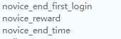

# Quest

    level等级到达 4 级时，触发新手quest！

`first_quest_end_ts`: 新手quest结束时间（修改为过去时间戳可跨过新手quest）

## 新手基金

    level等级到达 3 级时，触发新手基金活动！
  
`novice_end_first_login`: 最后一次login 弹出的结束时间 (时间戳)  
`novice_reward`: 领奖数据  
`novice_end_time`: 新手基金倒计时 (时间戳)  

